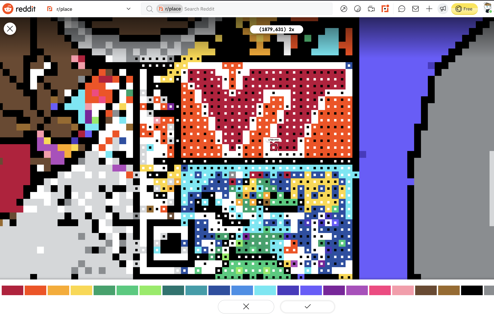

# r/Place Overlay User Script (for r/PlaceQRCode)

## r/PlaceQRCode

This is a fork of the r/Place Overlay user script I created to help communities maintain a coherent image on r/Place. Here you'll find all you need to get an overlay of the correct image on [r/Place](https://www.reddit.com/r/place/) to correct errors and sabotage. Note, this is not a bot, I specifically made this a browser plugin so it requires user interaction to be used.

## Introduction

This is a [userScript](https://developer.mozilla.org/en-US/docs/Mozilla/Add-ons/WebExtensions/API/userScripts), which is basically just an extra peice of Javascript placed into a website designed to manipulate the page or add new features. What this userScript will do is to activate when on Reddit's [r/place](https://www.reddit.com/r/place) subreddit, scan the area where the overlay is looking to compare the tiles to a desired image, then alter the appearance of those tiles to show a smaller square within the tile of the correct color that tile should be to be a copy of the image provided. Basically, it's an overlay to help groups maintain an accurate image on r/place.

**Public Service Announcement**: you should always be careful when using unknown scripts from the internet. Forunately the functionality of this script is fairly simple so it's easy to see that all it's doing is comparing an image with r/place tiles' colors and not tracking you or something nefarious like that, but you should check on that yourself, including this script.

## Instructions

1. First, download the [ViolentMonkey](https://violentmonkey.github.io) user script management plugin for your browser.
  * For chrome/edge/vivaldi/brave browsers: [Chrome Web Store: Violentmonkey](https://chrome.google.com/webstore/detail/violentmonkey/jinjaccalgkegednnccohejagnlnfdag)
  * For firefox: [Firfox Browser Add-ons: Violentmonkey](https://addons.mozilla.org/en-GB/firefox/addon/violentmonkey/)
  * If you're on Safari, I don't have the time to support it right now, but the [TamperMonkey](https://www.tampermonkey.net/?ext=dhdg&browser=safari) plugin manager works on Safari and should work mostly the same way as ViolentMonkey, so give it a try.

2. Install the user script by clicking this [link](https://greasyfork.org/scripts/442564-r-place-overlay/code/rPlace%20Overlay.user.js) to install it to the script manager.

## Developer Notes

The overlay works by finding the shadow DOM element where the r/place canvas takes place. Then the `qroverlay.png` I've created is inserted.
